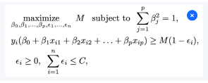
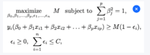
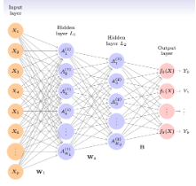

# Tests de Aprendizaje Estadístico

## Índice
1. [Test 09/10/2024](#test-09102024)
2. [Test 16/10/2024](#test-16102024)
3. [Test 23/10/2024](#test-23102024)
4. [Test 30/10/2024](#test-30102024)
5. [Test 05/11/2024](#test-05112024)
6. [Test 19/11/2024](#test-19112024)
7. [Test 26/11/2024](#test-26112024)
8. [Test 03/12/2024](#test-03122024)
9. [Test 17/12/2024](#test-17122024)

## Test 09/10/2024

### Pregunta 1
Dado un modelo de regresión lineal, indicadores como el R², el error cuadrático medio (MSE), el error estándar relativo (RSE), tienen como finalidad:

a) Evaluar si el modelo debe ser cuadrático.\
b) Evaluar la calidad del modelo.\
c) Ninguna de las dos respuestas anteriores

    
Respuesta

    b

    
Explicación

    Estos indicadores evalúan qué tan bien se ajusta el modelo a los datos. Por ejemplo, R&sup2; mide la proporción de la variabilidad explicada, mientras que MSE y RSE cuantifican el error promedio.

### Pregunta 2
Supongamos que hemos calculado los parámetros de un modelo de regresión lineal simple, $Y = \beta_0 + \beta_1X$. Entonces:

a) $\beta_0 = Y − \beta_1X, \beta_1 = \rho = \text{coeficiente de correlación}$.\
b) $\beta_0 = Y − \beta_1X, \beta_1 = \frac{\sum_{i=1}^n (x_i−X)(y_i−Y)}{\sum_{i=1}^n (x_i−X)^2}$.\
c) Ninguna de las respuestas anteriores es correcta.

    
Respuesta

    b

    
Explicación

    Los parámetros &beta;0 y &beta;1 de la regresión lineal se calculan utilizando las fórmulas estándar que minimizan la suma de los errores cuadrados entre los valores observados y los predichos.

### Pregunta 3
En una regresión lineal simple, los intervalos de confianza al 95 % para β0 y β1 son:

a) $( \hat{\beta_0} - SE(\hat{\beta_0}), \hat{\beta_0} + SE(\hat{\beta_0}))$ y $( \hat{\beta_1} - SE(\hat{\beta_1}), \hat{\beta_1} + SE(\hat{\beta_1}))$.\
b) $( \hat{\beta_0} - 2SE(\hat{\beta_0}), \hat{\beta_0} + 2SE(\hat{\beta_0}))$ y $( \hat{\beta_1} - 2SE(\hat{\beta_1}), \hat{\beta_1} + 2SE(\hat{\beta_1}))$.\
c) Ninguna de las dos respuestas anteriores.

    
Respuesta

    b

    
Explicación

    Los intervalos de confianza al 95 % se calculan como el estimador más/menos dos veces el error estándar (SE). Estos intervalos reflejan la incertidumbre en la estimación de los parámetros.

### Pregunta 4
¿Qué representa un coeficiente de correlación de 0.85?

a) No hay relación lineal entre las variables consideradas.\
b) Una relación negativa débil.\
c) Una relación positiva fuerte.\
d) Ninguna de las anteriores.\

    
Respuesta

    c

    
Explicación

    Un coeficiente de correlación de 0.85 indica una relación lineal positiva fuerte entre las dos variables. Esto significa que a medida que una variable aumenta, la otra también tiende a aumentar de manera proporcional.

### Pregunta 5
Si el $R^2$ de un modelo de regresión es 0.75, ¿qué significa esto?

a) El 75 % de la variabilidad de la variable dependiente se explica por la variable independiente.\
b) El 75 % de la variable independiente se explica por la variable dependiente.
c) No hay relación entre las variables.\
d) El modelo es ineficaz.\

    
Respuesta

    a

    
Explicación

    R&sup2; es una medida de bondad de ajuste que indica la proporción de la variabilidad en la variable dependiente explicada por el modelo. Un R&sup2; = 0.75 indica que el modelo explica el 75 % de esta variabilidad.

## Test 16/10/2024

### Pregunta 1
En la regresión logística, ¿qué se denomina log odds o logit?

a) $-β_0 - β_1X$  \
b) $β_0 + β_1X$  \
c) $\log(β_0 + β_1X)$  \
d) Ninguna de las anteriores.

    
Respuesta

    b

    
Explicación

    En regresión logística, el logit (log odds) es la transformación logarítmica de las probabilidades. Representa la relación lineal entre los predictores (X) y el logaritmo del cociente de probabilidades.

### Pregunta 2
¿Cuál es uno de los supuestos clave a la hora de aplicar LDA?

a) Las diferentes categorías tienen la misma media.  \
b) Las diferentes categorías son de diferente tamaño.  \
c) No hay correlación entre variables.  \
d) Las variables predictores siguen una distribución normal por categoría.

    
Respuesta

    d

    
Explicación

    Uno de los principales supuestos del Análisis Discriminante Lineal (LDA) es que las variables predictoras siguen una distribución normal dentro de cada clase, lo que permite derivar reglas de clasificación óptimas.

### Pregunta 3
¿Cuál es la principal diferencia entre LDA y regresión logística?

a) LDA se utiliza para problemas de clasificación binaria, mientras que la regresión logística se utiliza para problemas de clasificación múltiple.\
b) LDA asume normalidad y homogeneidad de varianzas, mientras que la regresión logística no lo hace.\
c) No hay ninguna diferencia.

    
Respuesta

    b

    
Explicación

    LDA tiene como supuestos clave la normalidad de las variables predictoras y la igualdad de varianzas-covarianzas entre clases. La regresión logística no hace estas suposiciones y modela directamente la probabilidad de pertenencia a una clase.

### Pregunta 4
¿Cuál es la función utilizada en la regresión logística para modelar la probabilidad, con un solo predictor X y Y binaria?

a) $\frac{1}{1+e^{\beta_1X}}$\
b) $\frac{1}{1+e^{\beta_0+\beta_1X}}$\
c) $\frac{e^{\beta_0+\beta_1X}}{1+e^{\beta_0+\beta_1X}}$\
d) $\frac{e^{\beta_0+\beta_1X}}{1+e^{-\beta_0-\beta_1X}}$

    
Respuesta

    c

    
Explicación

    En la regresión logística, la probabilidad de que una observación pertenezca a una clase es modelada por la función logística 
<code>
&#x1D6FC; = 1 / (1 + e-(&#x3B2;0 + &#x3B2;1X))
</code>, 
que transforma valores lineales en un rango entre 0 y 1.

### Pregunta 5
¿Cuál es el objetivo principal del Análisis Discriminante Lineal (LDA)?

a) Maximizar la varianza entre clases.\
b) Minimizar la varianza dentro de las clases.\
c) Clasificar observaciones en grupos.\
d) Predecir valores continuos.

    
Respuesta

    c

    
Explicación

    El objetivo principal del LDA es encontrar una combinación lineal de variables predictoras que maximice la separación entre clases, permitiendo clasificar observaciones en grupos definidos.

## Test 23/10/2024

## Test 30/10/2024

### Pregunta 1
¿Qué técnica penaliza la suma de los valores absolutos de los coeficientes de regresión, a excepción del independiente?

a) Subset Selection\
b) Ridge Regression\
c) Lasso Regression\
d) Ninguno de los anteriores

    
Respuesta

    c

    
Explicación

    La regresión Lasso penaliza la suma de los valores absolutos de los coeficientes, lo que puede forzar algunos coeficientes a ser exactamente cero, seleccionando un subconjunto de predictores relevantes. Esto la diferencia de Ridge Regression, que penaliza la suma de los cuadrados.

### Pregunta 2
Los estadísticos Mallow’s Cp, Akaike Information Criterion (AIC), Bayesian Information Criterion (BIC) y Adjusted R² tienen como finalidad:

a) Estudiar la colinealidad de los predictores dados.\
b) Estimar el error para seleccionar entre un conjunto de modelos con diferentes números de predictores.\
c) Ninguna de las anteriores.

    
Respuesta

    b

    
Explicación

    Estos criterios ayudan a comparar modelos con distintos números de predictores, equilibrando el ajuste al conjunto de datos y la complejidad del modelo, para seleccionar el modelo más adecuado.

### Pregunta 3
¿Cuál de las siguientes afirmaciones sobre Lasso es verdadera?

a) Siempre produce modelos más complejos que Ridge.\
b) Puede eliminar completamente algunos predictores del modelo.\
c) Válido cuando el número de observaciones es mayor que el número de predictores.\
d) Todas las anteriores.

    
Respuesta

    b

    
Explicación

    Lasso puede reducir los coeficientes de algunos predictores exactamente a cero, lo que implica su eliminación del modelo. Esto no ocurre con Ridge, que solo reduce los coeficientes pero nunca los elimina por completo.

### Pregunta 4
¿Cuál es el objetivo principal de la técnica de subset selection?

a) Aumentar la cantidad de predictores en el modelo.\
b) Identificar el mejor subconjunto de predictores que minimiza el error de predicción.\
c) Aumentar la complejidad del modelo.\
d) Reducir el tiempo de entrenamiento del modelo.

    
Respuesta

    b

    
Explicación

    Subset selection busca el conjunto óptimo de predictores que ofrezca el mejor equilibrio entre ajuste y simplicidad, minimizando el error de predicción en nuevos datos.

### Pregunta 5
Al hacer regulación de Ridge, dado λ, ¿qué problema estamos planteando?

a) Minimizo $\sum_{i=1}^n (y_i - \beta_0 - \beta_1 x_{i1} - \cdots - \beta_p x_{ip})^2 + \lambda \sum_{j=1}^p |\beta_j|$\
b) Minimizo $\sum_{i=1}^n (y_i - \beta_0 - \beta_1 x_{i1} - \cdots - \beta_p x_{ip})^2 + \lambda \sum_{j=1}^p \beta_j^2$\
c) Ninguna de las anteriores.

    
Respuesta

    b

    
Explicación

    La regresión Ridge penaliza la suma de los cuadrados de los coeficientes (&beta;j2) además del error cuadrático, lo que reduce la magnitud de los coeficientes para evitar problemas de sobreajuste y colinealidad.

## Test 05/11/2024

### Pregunta 1
¿Cuál de las siguientes afirmaciones sobre el PCA es FALSA?

a) El PCA es un método no supervisado.\
b) Para aplicar PCA, es estrictamente necesario que las variables originales sigan una distribución normal.\
c) El PCA puede utilizarse para hacer regresión.\
d) Todas las anteriores son falsas.

    
Respuesta

    b

    
Explicación

    El PCA no requiere que las variables sigan una distribución normal. Este es un error común, ya que el PCA solo busca maximizar la varianza de los datos, independientemente de su distribución.

### Pregunta 2
¿Cuál es la principal diferencia entre PCA y PLS?

a) No hay diferencia alguna.\
b) PCA busca maximizar la varianza de los datos (de los predictores si se está realizando regresión), mientras que PLS busca maximizar la covarianza entre las variables predictoras y la variable respuesta.\
c) PCA es un método supervisado, mientras que PLS es un método no supervisado.\
d) El PCA no se puede utilizar en regresión, el PLS sí.

    
Respuesta

    b

    
Explicación

    PCA es un método no supervisado que maximiza la varianza de los datos, mientras que PLS incorpora la variable respuesta para maximizar la covarianza con los predictores, siendo así un método supervisado.

### Pregunta 3
Sean λ1 ≥ λ2 ≥ ··· ≥ λp los valores propios de la matriz de correlación. La proporción de la varianza explicada por las k primeras componentes principales es:

a) $\frac{1}{1-e^{-(\lambda_1+\cdots+\lambda_k)}}$\
b) $\frac{\lambda_1+\cdots+\lambda_k}{\lambda_1+\cdots+\lambda_p}$\
c) $\lambda_1 + \cdots + \lambda_k$\
d) Ninguna de las anteriores es correcta.

    
Respuesta

    b

    
Explicación

    La proporción de la varianza explicada por las k primeras componentes principales se calcula dividiendo la suma de los valores propios correspondientes a esas componentes entre la suma total de los valores propios.

### Pregunta 4
El PCA, a pesar de ser una herramienta para la reducción de dimensionalidad, ¿qué inconvenientes podría tener?

a) Interpretabilidad de los componentes principales.\
b) Si las relaciones entre las variables no son lineales, el PCA puede no capturar adecuadamente la estructura de los datos.\
c) Ambas son correctas.

    
Respuesta

    c

    
Explicación

    Aunque el PCA es útil para reducir la dimensionalidad, los componentes principales son combinaciones lineales de las variables originales, lo que puede dificultar su interpretación y limitar su eficacia si las relaciones entre las variables son no lineales.

### Pregunta 5
En el PCA, los loadings (o las direcciones de las componentes principales) vienen definidos por:

a) Los vectores propios de la matriz definida por las variables estandarizadas.\
b) Los vectores propios de la matriz de correlación.\
c) Ninguna de las anteriores es correcta.

    
Respuesta

    b

    
Explicación

    Los loadings en PCA corresponden a los vectores propios de la matriz de correlación (o matriz de covarianza), dependiendo de cómo se definan las variables originales.

### Pregunta 6
En Ridge Regression, ¿cuál es el efecto principal de agregar el término de penalización?

a) Aumentar la complejidad del modelo.\
b) Eliminar completamente ciertos predictores.\
c) Reducir la magnitud de los coeficientes, pero no a cero.\
d) Mejora la interpretabilidad del modelo.

    
Respuesta

    c

    
Explicación

    La penalización en Ridge Regression disminuye los valores de los coeficientes para reducir la complejidad del modelo y evitar problemas de sobreajuste, pero nunca los reduce completamente a cero.

### Pregunta 7
¿Cuál es la función utilizada en la regresión logística para modelar la probabilidad, con un solo predictor X y Y binaria?

a) $\frac{1}{1+e^{\beta_1X}}$\
b) $\frac{1}{1+e^{\beta_0+\beta_1X}}$\
c) $\frac{e^{\beta_0+\beta_1X}}{1+e^{\beta_0+\beta_1X}}$\
d) $\frac{e^{\beta_0+\beta_1X}}{1+e^{-\beta_0-\beta_1X}}$

    
Respuesta

    c

    
Explicación

    La función logística transforma una combinación lineal de los predictores (&beta;0 + &beta;1X) en probabilidades entre 0 y 1.

### Pregunta 8
¿Cuál es el objetivo principal del Análisis Discriminante Lineal (LDA)?

a) Maximizar la varianza entre clases.\
b) Minimizar la varianza dentro de las clases.\
c) Clasificar observaciones en grupos.\
d) Predecir valores continuos.

    
Respuesta

    c

    
Explicación

    El LDA busca maximizar la separación entre clases utilizando una combinación lineal de las variables predictoras para clasificar observaciones en diferentes grupos.

### Pregunta 9
¿Qué significa que un modelo está sobreajustado (overfitting)?

a) El modelo tiene demasiados parámetros.\
b) El modelo se ajusta muy poco a los datos de entrenamiento y no captura la relación entre las variables.\
c) El modelo se ajusta demasiado bien a los datos de entrenamiento y no generaliza bien a nuevos datos.\
d) Ninguna de las anteriores.

    
Respuesta

    c

    
Explicación

    Un modelo sobreajustado memoriza los datos de entrenamiento en lugar de aprender patrones generales, lo que reduce su capacidad de generalización.

### Pregunta 10
¿Cuál de las siguientes es una medida común del error en regresión lineal con sólo un parámetro?

a) Coeficiente de correlación.\
b) Error cuadrático medio (MSE).\
c) R².\
d) Todas las anteriores.

    
Respuesta

    d

    
Explicación

    El coeficiente de correlación, el error cuadrático medio (MSE) y R² son medidas utilizadas para evaluar el error o el ajuste de un modelo de regresión lineal.

## Test 19/11/2024

### Pregunta 1
¿Por qué es importante normalizar los predictores cuando se utiliza la distancia Euclidiana como métrica?

a) Para asegurar que las variables con escalas diferentes no dominen la distancia calculada.\
b) Porque la normalización garantiza que las distancias siempre serán menores a 1.\
c) Para evitar que el modelo genere predicciones sesgadas hacia valores extremos de las variables.\
d) Porque la distancia Euclidiana no funciona si los datos no están normalizados.

    
Respuesta

    a

    
Explicación

    En el método de k-vecinos más cercanos (k-NN), la distancia Euclidiana mide la cercanía entre puntos en un espacio de características. Si los predictores tienen diferentes escalas, aquellos con valores más grandes tendrán un mayor impacto en la distancia calculada, afectando negativamente al modelo. La normalización pone todas las variables en una escala comparable, generalmente entre [0,1] o con media 0 y desviación estándar 1, asegurando que ninguna variable domine la métrica.

### Pregunta 2
¿Por qué el proceso de construcción de un árbol de decisión en machine learning se denomina Recursive Binary Splitting?

a) Porque el árbol se construye dividiendo repetidamente los datos en múltiples grupos para maximizar la cantidad de clases.\
b) Porque utiliza operadores binarios para dividir los datos en dos conjuntos iguales en cada paso.\
c) Porque en cada nodo se realiza una partición binaria del conjunto de ejemplos aplicando repetidamente el mismo criterio de división.\
d) Porque todos los nodos del árbol se dividen recursivamente en ramas múltiples, no necesariamente binarias.

    
Respuesta

    c

    
Explicación

    En la construcción de un árbol de decisión, en cada nodo los datos se dividen en dos subconjuntos (binario) según un criterio de optimización como la reducción de la impureza (índice Gini o entropía). Este proceso se repite recursivamente en los nodos hijos hasta que se cumpla un criterio de parada, como un número mínimo de ejemplos o un umbral de ganancia.

### Pregunta 3
¿Qué representa el índice Gini en la construcción de árboles de decisión?
$$
\text{Gini} = 1 - \sum_{i=1}^{C} p_i^2
$$

a) Una fórmula para calcular la profundidad máxima que debe tener un árbol de decisión.\
b) Una medida de la impureza de un nodo, donde valores más bajos indican mayor homogeneidad en las clases.\
c) Una métrica que calcula la distancia promedio entre las observaciones dentro de un nodo.\
d) Una medida que garantiza que todos los nodos tengan el mismo número de ejemplos.

    
Respuesta

    b

    
Explicación

    El índice Gini evalúa qué tan mezcladas están las clases dentro de un nodo. Su fórmula es:
    <code>
    Gini = 1 - &sum;i=1C pi2
    </code>
    donde <i>pi</i> es la proporción de ejemplos de la clase <i>i</i> en el nodo. Un nodo puro (solo una clase) tiene un índice Gini de 0, mientras que la máxima impureza ocurre con una distribución uniforme de clases. Durante la construcción del árbol, se busca minimizar el índice Gini.

### Pregunta 4
Identifica una ventaja atribuible a los árboles de decisión en machine learning.

a) No necesitan de la creación de variables ficticias para manejar predictores cualitativos.\
b) Siempre ofrecen una mayor precisión predictiva en comparación con otros enfoques de regresión y clasificación.\
c) Son fáciles de interpretar y transmitir, incluso por personas sin experiencia, especialmente cuando son pequeños.\
d) Su proceso de construcción se puede representar gráficamente.

    
Respuesta

    c

    
Explicación

    Los árboles de decisión presentan decisiones como reglas lógicas organizadas jerárquicamente, lo que los hace intuitivos y fáciles de comprender. Un árbol pequeño puede representarse visualmente o como una lista de reglas si-entonces, siendo accesible incluso para personas sin formación técnica.

### Pregunta 5
¿Cuál es el objetivo principal del algoritmo de costo-complejidad aplicado a árboles de decisión?
$$
C_\alpha(T) = R(T) + \alpha|T|
$$

a) Maximizar el número de nodos terminales para aumentar la capacidad predictiva del árbol.\
b) Reducir el error de entrenamiento al construir un árbol completamente desarrollado sin restricciones.\
c) Garantizar que todos los nodos del árbol tengan el mismo número de ejemplos para equilibrar las particiones.\
d) Encontrar el balance entre precisión y simplicidad, seleccionando el subárbol que minimiza el sobreajuste a los datos.

    
Respuesta

    d

    
Explicación

    El algoritmo de costo-complejidad combina la precisión del modelo (<i>R(T)</i>) y su complejidad (<i>|T|</i>, número de nodos) en la siguiente métrica:
    <i>C&alpha;(T) = R(T) + &alpha;|T|</i>
    donde <i>&alpha;</i> controla el balance entre precisión y simplicidad. Se utiliza para podar el árbol eliminando ramas que no contribuyen significativamente a la reducción del error. Esto reduce el sobreajuste y mejora la generalización del modelo.

## Test 26/11/2024

### Pregunta 1
¿Cuál es el objetivo principal de la técnica conocida como "Bootstrap Aggregation" o "Bagging" en el aprendizaje estadístico?

a) Reducir el sesgo de un método de aprendizaje estadístico.\
b) Incrementar la complejidad de los árboles de decisión.\
c) Reducir la varianza de un método de aprendizaje estadístico mediante el promedio de múltiples observaciones.\
d) Aumentar el número de conjuntos de entrenamiento disponibles.

    
Respuesta

    c

    
Explicación

    Bagging reduce la varianza al combinar múltiples modelos entrenados en subconjuntos bootstrap del conjunto de datos original. Al promediar las predicciones de estos modelos, se obtiene un modelo más robusto y estable.

### Pregunta 2
¿Cuál es el propósito principal de las observaciones "out-of-bag" (OOB) en el método de bagging?

a) Aumentar la varianza del modelo al excluir datos del entrenamiento.\
b) Estimar el error de prueba del modelo bagged sin necesidad de conjuntos de prueba adicionales.\
c) Reducir el número de árboles necesarios en el modelo bagged.\
d) Identificar las observaciones que más contribuyen al sesgo del modelo.

    
Respuesta

    b

    
Explicación

    Las observaciones OOB (out-of-bag) son aquellas no incluidas en un subconjunto bootstrap. Estas se utilizan para evaluar el error del modelo sin necesidad de un conjunto de prueba separado.

### Pregunta 3
¿Cuál es la principal diferencia entre los bosques aleatorios (random forests) y los árboles generados mediante bagging?

a) Los bosques aleatorios construyen árboles utilizando la totalidad de los predictores en cada división del árbol.\
b) En los bosques aleatorios, los árboles se construyen utilizando subconjuntos aleatorios de predictores en cada división, reduciendo la correlación entre los árboles.\
c) Los bosques aleatorios utilizan menos árboles que el bagging para reducir el tiempo de cálculo.\
d) El bagging selecciona predictores fijos en cada división, mientras que los bosques aleatorios utilizan todos los predictores disponibles.

    
Respuesta

    b

    
Explicación

    En random forests, se selecciona aleatoriamente un subconjunto de predictores en cada división, lo que reduce la correlación entre los árboles y mejora el desempeño del modelo combinado.

### Pregunta 4
¿Cuál es una característica clave del método de boosting al aplicarse a árboles de decisión?

a) Cada árbol en boosting corrige los errores cometidos por los árboles previamente construidos.\
b) Los árboles se construyen utilizando conjuntos de datos generados aleatoriamente e independientes entre sí.\
c) Boosting combina los árboles generados utilizando la media de sus predicciones.\
d) Los árboles en boosting son siempre más grandes que los utilizados en bagging.

    
Respuesta

    a

    
Explicación

    En boosting, cada árbol se construye secuencialmente para corregir los errores de los árboles anteriores, aumentando progresivamente el peso en las observaciones mal clasificadas.

### Pregunta 5
El parámetro alfa en el algoritmo Adaboost.M1

a) Es el logaritmo de la razón entre 1 menos los errores del clasificador global promediados por el peso del ejemplo correspondiente, dividido por el peso del ejemplo correspondiente.\
b) Es el logaritmo de la razón entre 1 menos los errores del clasificador en la iteración actual promediados por el peso del ejemplo correspondiente, dividido por el peso del ejemplo correspondiente.\
c) Es el logaritmo de la razón entre 1 menos los errores del clasificador global promediados por el peso del ejemplo correspondiente, dividido por dicho error.\
d) Es el logaritmo de la razón entre 1 menos los errores del clasificador en la iteración actual promediados por el peso del ejemplo correspondiente, dividido por dicho error.

    
Respuesta

    d

    
Explicación

    En Adaboost.M1, el parámetro alfa (α) mide la confiabilidad de un clasificador débil. Se calcula como
    <code>
    αt = 1/2 ln((1 − εt) / εt)
    </code>,
    donde εt es el error ponderado del clasificador en la iteración actual.

## Test 03/12/2024

### Pregunta 1

    

En un problema con clasificador lineal, el problema de optimización de la figura genera un

a) clasificador de vectores soporte.\
b) clasificador de margen máximo.\
c) máquina de vectores soporte.\
d) ninguna de las anteriores.

    
Respuesta

    c

    
Explicación

    El problema de optimización presentado corresponde a una Máquina de Vectores Soporte (SVM) con margen suave. Este modelo maximiza el margen mientras permite violaciones controladas del mismo mediante las variables de holgura εi. Por lo tanto, la opción correcta es máquina de vectores soporte.

### Pregunta 2
Un kernel en la técnica de máquinas de vectores soporte

a) Toma como argumentos la máquina de vectores soporte y un punto del espacio. Cuantifica la distancia ortogonal entre la frontera de decisión inducida por la máquina y el punto.\
b) Toma como argumentos la máquina de vectores soporte y un punto del espacio. Cuantifica la distancia mínima entre la frontera de decisión inducida por la máquina y el punto.\
c) Toma como argumentos dos puntos del espacio de características. Cuantifica la similitud entre los puntos.\
d) Ninguna de las anteriores.

    
Respuesta

    c

    
Explicación

    En las máquinas de vectores soporte (SVM), el kernel es una función que mide la similitud entre dos puntos en el espacio de características. Esto permite proyectar los datos en un espacio de mayor dimensión para hacer separables linealmente conjuntos de datos que no lo son en el espacio original.

### Pregunta 3

    

En el problema de optimización, los εi funcionan de tal forma que

a) Si εi > 0, entonces el ejemplo i-ésimo está en el lado incorrecto del margen.\
b) Si εi > 0, entonces el ejemplo i-ésimo está en el lado correcto del margen.\
c) Si εi > 1, entonces el ejemplo i-ésimo está en el lado correcto del hiperplano.\
d) Ninguna de las anteriores.

    
Respuesta

    a

    
Explicación

    Las variables εi representan las violaciones al margen. Si εi = 0, el punto está correctamente clasificado y fuera del margen. Si 0 < εi ≤ 1, el punto está dentro del margen pero en el lado correcto. Si εi > 1, el punto está clasificado incorrectamente.

### Pregunta 4
Los kernels polinomial y radial

a) Proporcionan múltiples fronteras de decisión que superpuestas consiguen un comportamiento complejo.\
b) Consiguen simular comportamientos no lineales mediante simples funciones lineales.\
c) Proporcionan fronteras de decisión no lineales.\
d) Requieren de la optimización de un vector de parámetros d (para el polinomial) y γ (para el radial), de dimensiones p, siendo p el número de características.

    
Respuesta

    c

    
Explicación

    Los kernels polinomial y radial transforman los datos en un espacio de mayor dimensión, donde las clases pueden ser separadas de manera lineal, pero esta separación se traduce en fronteras no lineales en el espacio original.

### Pregunta 5
Cuando el número de clases de nuestro problema de clasificación es mayor que 2, SVM

a) Se puede aplicar de dos formas diferentes, bien OVA bien OVO. En OVA ajustamos K clasificadores binarios. En OVO tantos clasificadores como pares distintos. Cuando el número de clases no es muy alto, preferimos OVO.\
b) Se puede aplicar de dos formas diferentes, bien OVA bien OVO. En OVA ajustamos K clasificadores binarios. En OVO tantos clasificadores como pares distintos. Cuando el número de clases no es muy alto, preferimos OVA.\
c) Se puede aplicar de dos formas diferentes, bien OVO bien OVA. En OVO ajustamos K clasificadores binarios. En OVA tantos clasificadores como pares distintos. Cuando el número de clases no es muy alto, preferimos OVA.\
d) Se puede aplicar de dos formas diferentes, bien OVO bien OVA. En OVO ajustamos K clasificadores binarios. En OVA tantos clasificadores como pares distintos. Cuando el número de clases no es muy alto, preferimos OVO.

    
Respuesta

    a

    
Explicación

    El método OVA (One-Versus-All) requiere entrenar K clasificadores, uno para cada clase contra todas las demás, mientras que OVO (One-Versus-One) entrena K(K − 1)/2 clasificadores para cada par de clases. OVO es preferido cuando el número de clases es bajo porque permite decisiones más directas entre pares de clases.

## Test 17/12/2024

### Pregunta 1
Las funciones de activación:

a) Cumplen una función de normalización de los datos, normalizando los datos de entrada bien en [−1,1] bien en [0,1].\
b) Dotan de comportamiento no lineal a las redes neuronales.\
c) Más conocidas son las de tangente hiperbólica, sigmoidal y dropout.\
d) Ninguna de las anteriores.

    
Respuesta

    b

    
Explicación

    Las funciones de activación introducen no linealidad en las redes neuronales, permitiendo que estas aprendan patrones complejos en los datos. Sin esta no linealidad, las redes serían equivalentes a modelos lineales, independientemente del número de capas. Algunas de las funciones de activación más comunes son ReLU, sigmoide y tangente hiperbólica. Cabe destacar que dropout no es una función de activación, sino una técnica de regularización.

### Pregunta 2
La función softmax en redes neuronales:

a) Se utiliza en problemas de clasificación, en los nodos de salida de la red, para distribuir la probabilidad de la observación de pertenecer a cada clase.\
b) Se utiliza en la activación de las capas ocultas para distribuir el error equitativamente entre todos los nodos.\
c) Es una alternativa eficiente a la función sigmoidal, arcotangente y ReLU, en las funciones de activación.\
d) Ninguna de las anteriores es cierta.

    
Respuesta

    a

    
Explicación

    La función softmax transforma los valores de salida (logits) en probabilidades normalizadas, haciendo que la suma de estas probabilidades sea igual a 1. Es ampliamente utilizada en problemas de clasificación multiclase en la capa de salida de las redes neuronales. No se usa en capas ocultas ni es una alternativa a funciones como ReLU; su uso es específico para convertir los valores de salida en una distribución de probabilidad.

### Pregunta 3

    

La expresión con la que obtenemos el número exacto de parámetros de la red neuronal de la figura es, teniendo en cuenta que con M(i × j) nos referimos a una matriz de i filas y j columnas:

a) M(p × K1) + M(K1 × K2) + M(K2 × 10) + p + K1 + K2\
b) M(p × K1) + M(K1 × K2) + M(K2 × 10) + 10\
c) M(p × K1) + M(K1 × K2) + M(K2 × 10) + p + K1 + K2 + 10\
d) M(p × K1) + M(K1 × K2) + M(K2 × 10) + K1 + K2 + 10

    
Respuesta

    d

    
Explicación

    Para calcular el número total de parámetros de la red neuronal, consideramos:
    Los pesos entre las capas:
    M(p × K1), M(K1 × K2), M(K2 × 10)
    Los sesgos (bias) de cada capa:
    K1 (primera capa oculta), K2 (segunda capa oculta), 10 (capa de salida).
    La suma de todos estos términos nos da el número total de parámetros:
    M(p × K1) + M(K1 × K2) + M(K2 × 10) + K1 + K2 + 10.

### Pregunta 4
En las redes neuronales de convolución los filtros de convolución:

a) Son matrices de parámetros que es necesario aprender y que forman parte de la red neuronal propiamente dicha.\
b) Son mecanismos de filtrado de imágenes fijos que se conectan a la red para que la imagen llegue libre de ruido a la red neuronal propiamente dicha.\
c) Son mecanismos de filtrado intercambiables ajustables por el usuario que se conectan a la red para que la imagen llegue libre de ruido a la red neuronal propiamente dicha.\
d) Ninguna de las anteriores.

    
Respuesta

    a

    
Explicación

    En las redes neuronales convolucionales, los filtros (o kernels) son matrices de parámetros entrenables que aprenden a extraer características relevantes de las imágenes, como bordes, texturas o patrones. Estos filtros no son fijos ni definidos por el usuario; en su lugar, se optimizan durante el proceso de entrenamiento mediante retropropagación para minimizar la función de pérdida.

### Pregunta 5
Dado un ejemplo, formado por una secuencia de tokens a la entrada $X_1, X_2, \ldots, X_t$ a procesar por una red recurrente:

a) La matriz de pesos $W$ se encarga de procesar el token a la entrada, la matriz $U$ se encarga de gestionar la recurrencia y la matriz $B$ de cómo producir una salida para ese token.\
b) La matriz de pesos $W$ se encarga de codificar el token a la entrada en forma de embedding, la matriz $U$ se encarga de asociarlo con los tokens ya vistos, la matriz $B$ con los tokens que quedan por procesar.\
c) La matriz de pesos $W$ se encarga de codificar el token a la entrada en forma de embedding, la matriz $U$ se encarga de gestionar la recurrencia, la matriz $B$ se encarga de asociar el token a la entrada con los tokens que quedan por procesar.\
d) La matriz de pesos $W$ se modifica a cada token mediante gradiente descendente, la matriz $U$ se mantiene fija después de unas pocas épocas de entrenamiento y la matriz $B$ solo se actualiza una vez procesado cada ejemplo por completo.

    
Respuesta

    a

    
Explicación

    En una red recurrente simple, la matriz <code>W</code> procesa cada token de entrada, generando una representación inicial; la matriz <code>U</code> se encarga de gestionar las dependencias temporales (recurrencia) al conectar el estado actual con el estado anterior; y la matriz <code>B</code> aplica un sesgo que ajusta la activación en cada paso temporal para producir la salida correspondiente.

### Pregunta 6
El vector de gradiente:

a) Nos marca la dirección de mayor variación de los pesos.\
b) Ninguna de las otras tres es cierta.\
c) Nos marca la dirección de mayor variación de los ejemplos con respecto a los pesos.\
d) Nos marca la dirección de mayor variación de la función de error de la red neuronal.

    
Respuesta

    d

    
Explicación

    El vector de gradiente representa la dirección en la que la función de error de una red neuronal aumenta más rápidamente. Es crucial en el proceso de optimización, donde los algoritmos como el descenso por gradiente utilizan esta dirección para actualizar los pesos de la red, buscando minimizar la función de error avanzando en la dirección opuesta al gradiente.

### Pregunta 7
La técnica de dropout:

a) Es una alternativa a la regularización L1 y L2 y se incluye en la función de pérdida.\
b) Se debe usar con cuidado porque añade una gran cantidad de parámetros a la red.\
c) Es un complemento a la regularización L1 y L2 y se incluye como capa en la red neuronal.\
d) Es conveniente porque no incorpora hiperparámetros al proceso de búsqueda del mejor modelo.

    
Respuesta

    c

    
Explicación

    La técnica de dropout es un método de regularización que consiste en desactivar aleatoriamente un porcentaje de las neuronas durante el entrenamiento de una red neuronal, con el objetivo de prevenir el sobreajuste. No reemplaza a L1 o L2, sino que puede complementarlas. Además, se implementa como una capa adicional en la arquitectura de la red, sin añadir nuevos parámetros al modelo, ya que actúa sobre las activaciones existentes.

